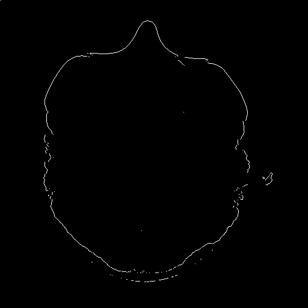
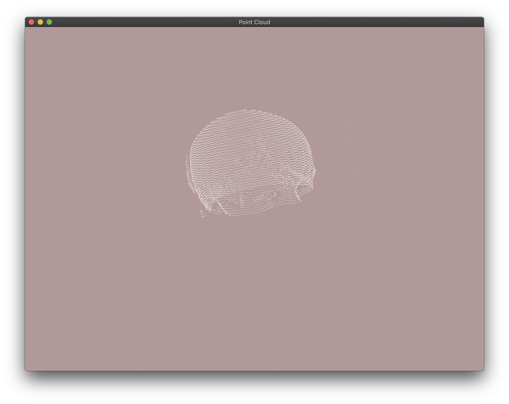

# Image reconstruction
Image reconstruction from 2D CT slices.

## Run
First download CT images (link below) and put in directory "data" (or change path in `main.cpp`)
```
# MacOS only
g++ --std=c++11 -w main.cpp src/*.cpp -I lib/ -I include -lX11  -lGLEW -lGLUT -lGLFW -framework OpenGL  -o run && ./run
```

## CT images
Available in Google Drive [here](https://drive.google.com/file/d/1Gwc3uNTiqNRa6ok1WnLLHVYmjUKu4yKt/view?usp=sharing).

## Examples
#### Contours


#### Point Cloud
 

